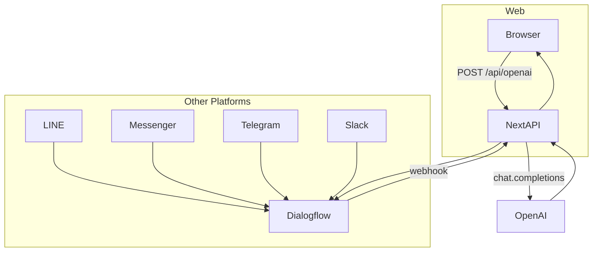
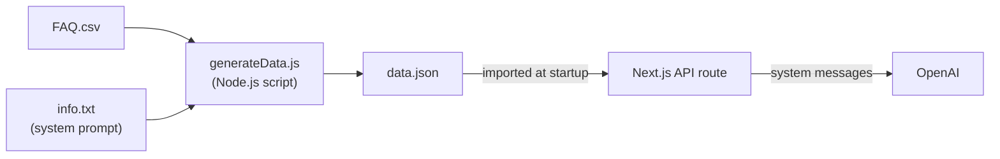

# gen-ai

A ChatGPT-based multilingual customer service chatbot — built as a master's thesis and published at IEEE Xplore.

<p align="center">
  <a href="https://ieeexplore.ieee.org/document/10852436">
    
  </a>
  
  
  
  
  
  
</p>

## Publication

> **Generative AI Agents, Build a Multilingual ChatGPT-based Customer Service Chatbot**
> Nien-Ying Chou — Master of Science, Software Engineering, University of Europe for Applied Sciences (2024)
> Published in IEEE Xplore: [https://ieeexplore.ieee.org/document/10852436](https://ieeexplore.ieee.org/document/10852436)

This repository is the implementation artifact accompanying the thesis. It explores how a generative AI model can replace the traditional intent-classification pipeline for building multilingual customer service chatbots, reducing development effort while increasing language coverage.

## What it does

- **Any-language input, any-language response** — provide FAQ data in a single language; the LLM handles translation automatically. No multilingual training data required.
- **Cross-platform** — deployed as a web app and integrated into LINE, Messenger, Telegram, and Slack via a Google Dialogflow webhook.
- **Speech-to-text input** — Web SpeechRecognition API auto-detects `navigator.language` so users can speak in their preferred language.
- **Non-technical content management** — customer service knowledge lives in `FAQ.csv` and `info.txt`. Run one script and the chatbot is updated. No TypeScript knowledge required.
- **Conversation memory** — full chat history is passed as context on every request, enabling coherent multi-turn dialogue.

## Architecture

### Request flow



### Data pipeline



## Architecture decisions

**Why Next.js over a separate frontend and backend?**
A single repo covers both the React UI and the API route, shares TypeScript types end-to-end, and deploys to Vercel with zero configuration. It keeps the codebase small enough for a single maintainer.

**Why ChatGPT over Gemini or Claude?**
At the time of development, Gemini and Claude had restricted availability in Germany due to GDPR. ChatGPT was the only option with a reliable JavaScript API library and confirmed GDPR compliance.

**Why prompt engineering over fine-tuning?**
Customer service FAQ changes frequently. Fine-tuning requires reformatting data, uploading it to OpenAI, and waiting for a training run on every update. Prompt engineering with external files means updates are instant and require no API access.

**Why CSV + txt → JSON pipeline?**
Separating content from code allows non-engineers to update the chatbot's knowledge and personality without touching TypeScript. The parser script (`generateData.js`) validates and converts the files before the app starts, catching formatting errors early rather than at runtime.

**Why Dialogflow for platform integration?**
Dialogflow provides native connectors to LINE, Messenger, Telegram, and Slack. A single webhook endpoint handles all platforms instead of implementing separate integrations for each.

**Why single-language QA data works for all languages?**
OpenAI models respond in the language of the user's message regardless of the language the system prompt is written in. Maintaining one set of FAQ data is sufficient for full multilingual support.

**Known limitation**
Chat history is stored as a module-level variable on the server. In a single-instance deployment this means all users share one session. This is an intentional simplification for the thesis scope; a production system would use per-session storage (e.g. Redis keyed by session ID).

## Getting started

1. Create a `.env` file from the example:

```bash
cp .env.example .env
```

Set your OpenAI API key and optionally choose a model:

```env
NEXT_PUBLIC_OPEN_AI_KEY=sk-...
OPENAI_MODEL=gpt-4o-mini   # optional, defaults to gpt-4o-mini
```

2. Generate the chatbot data from the FAQ and system prompt files:

```bash
node generateData.js
```

3. Install dependencies and start the dev server:

```bash
npm install
npm run dev
```

Open [http://localhost:3000](http://localhost:3000) to interact with the chatbot.

## Project structure

```
src/
├── app/
│   ├── page.tsx          chat UI (Chakra UI, speech recognition)
│   └── layout.tsx        ChakraProvider wrapper
├── pages/api/
│   └── openai.ts         API route — assembles messages, calls OpenAI
└── utils/
    ├── openai.ts         OpenAI client initialisation
    └── extra-information.ts  loads data.json into system messages
data/
└── data.json             generated by generateData.js (git-ignored)
FAQ.csv                   customer service Q&A (edit this to update content)
info.txt                  chatbot personality and behaviour (edit this too)
generateData.js           parser script: CSV + txt → data.json
```

## License

MIT
